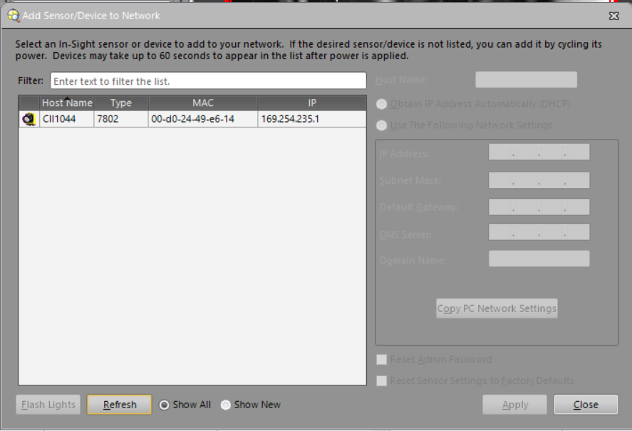
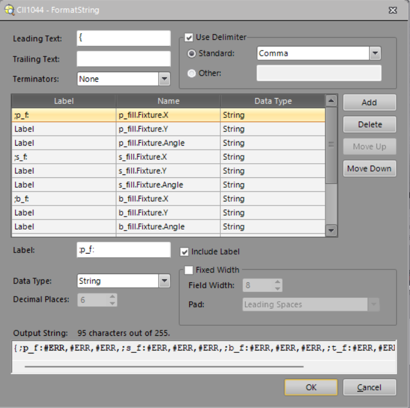

# Cognex Object Detection with RR Service

## Cognex Object Detection Setup with In-Sight Explorer

### Cognex Connection
Under `Add Sensor/Device to Network`, Cognex camera should appear with its IP address, make sure computer is set to DHCP.

### Object Training
Follow Cognex instruction to create pattern for object detection.

### Continuous Detection
Make Cognex camera trigger in Continuous mode, adjust image parameters according to the environment.

### Communication Setup
Under `Communications`->`TCP/IP`, set up IP of the PC as `Server Host Name` as shown in 

To format the message, go to `Format Output String` -> `Format String...`, and follow the same structure as shown in image below for every object. Notice maximum output string length is 255.

## RR Service for Cognex
`Cognex_objdet.py` provides an RR service wrapper for a socket connection with Cognex camera directly. This is highly customized from `final_with_no_objects.job` loaded in Cognex to parse the formatted string into pose data.

