# Cognex Setup for Robot Raconteur Driver using In-Sight Easy Builder

**These instructions are for using the In-Sight Easy Builder programming mode using In-Sight Explorer 6.5.0 and older. See the [spreadsheet instructions](cognex_setup_spreadsheet.md) for the spreadsheet programming mode.**

These instructions are for Cognex In-Sight Vision System sensors using the In-Sight Easy Builder wizard. This
mode is available for older devices that use In-Sight Explorer 6.5.0 and older. Newer devices will need
to use the spreadsheet mode.

They were tested with a 7000 series device but should work for other models that use In-Sight Explorer 6.5.0
and older.

## Device Setup

### Install Cognex In-Sight Software

The Cognex In-Sight software must be installed and communicating with the sensor. See the
[Cognex Download](https://support.cognex.com/en/downloads/in-sight/software-firmware) page to download the
software. See the documentation for instructions to configure network settings and communication with the sensor.

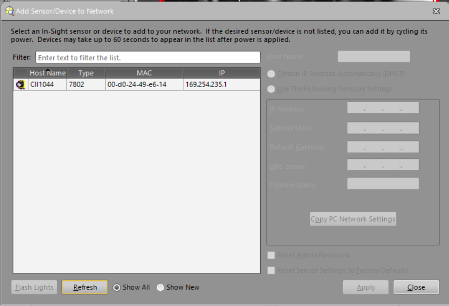

Save the IP address in this view. It will be needed later. The IP address can also be found by right
clicking on the device in the left list panel In-Sight Network and clicking Properties.

### Connect to Device

Select the detected Cognex and click Connect in the lower panel.

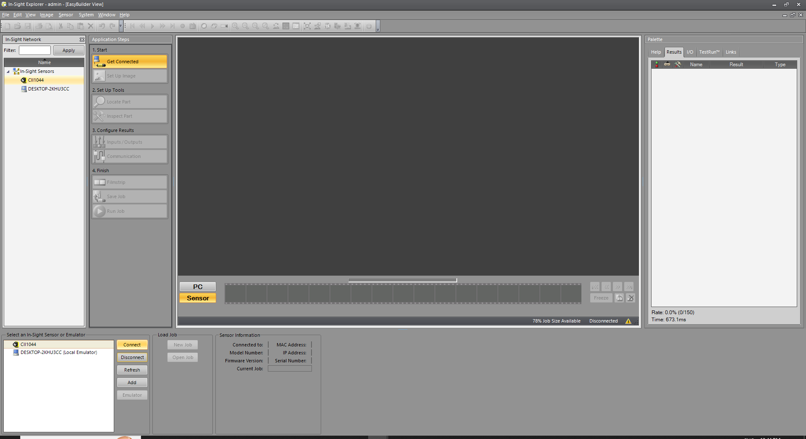

### Take Device Offline

If the device is "online", click the green power icon in the top toolbar to take the device offline. Confirm
taking the device offline.

### Set Up Image and Trigger

Select "Set Up Image" and click "Trigger" to capture a sample image. Also configure the calibration based on the
Cognex instructions. The trigger should be continuous unless there is another hardware trigger configured.

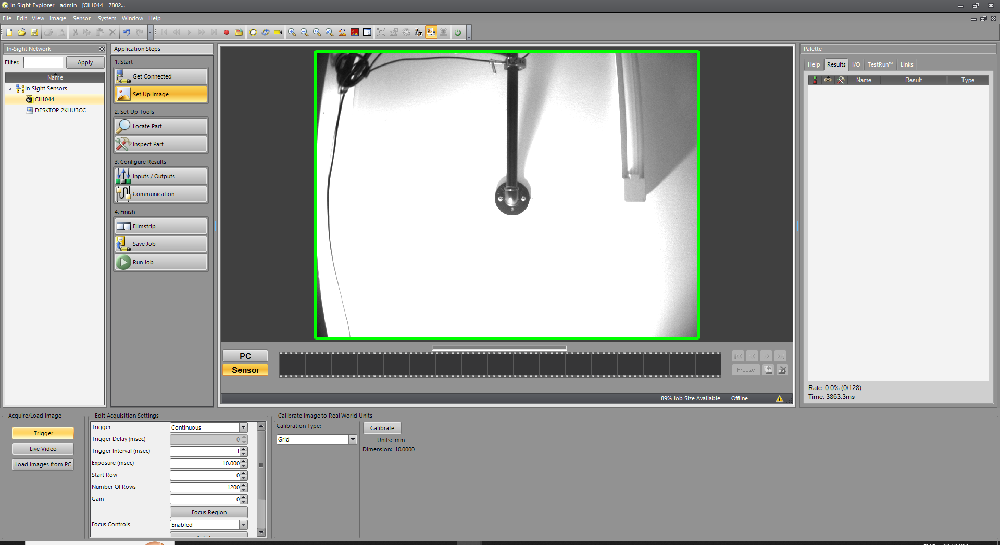

### Add Image Templates

Select "Locate Part" and select "Pattern" under "Add Tool" on the lower left, or any other of the options. Click "Add".

Adjust the magenta bounding box to surround the feature to detect. In this case, it is a support bracket. Click "OK" in the lower pane.

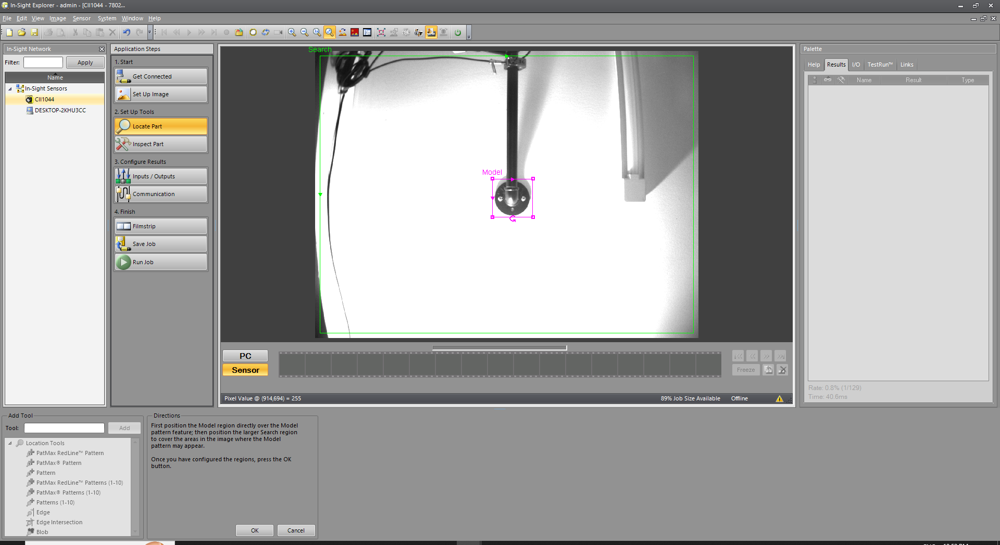

Rename the tool to the desired name for the object to be detected. In this example, it is renamed to "bracket". Set "Tool Fixture" to "None", and set "Tool Enabled" to "On".

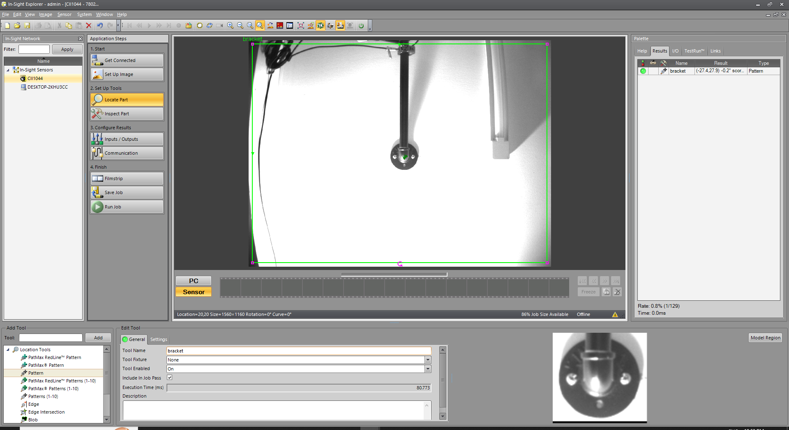

Repeat for any additional objects to detect. Give each object a distinct name.

### Configure Communication

Select "Communication" and set to TCP/IP. Configure the "Server Host Name" to be empty.
When empty, the device will act as a server. Note that this is a change from previous versions
of this driver that used a reverse socket. The port must be 3000.

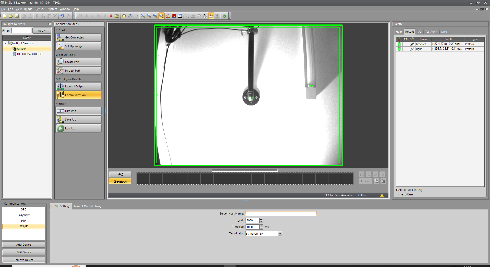

Select the "Format Output String" tab and click the "Format String..." button.

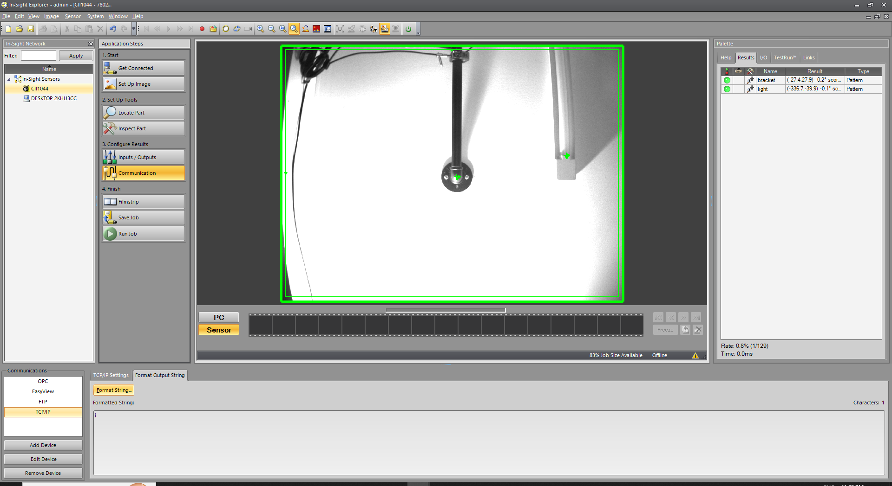

Click the "Add" button.

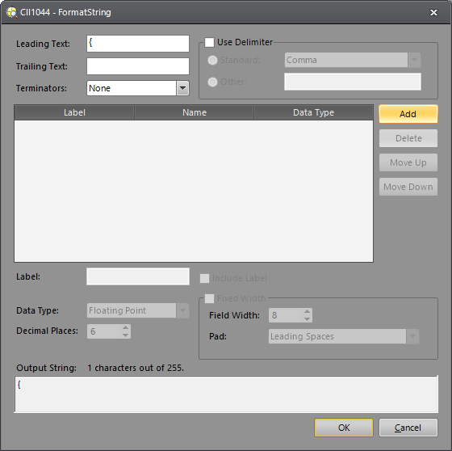

Select the feature to output, and click the "featurename.Fixture.X" and click OK. In this example, "featurename" is "bracket".

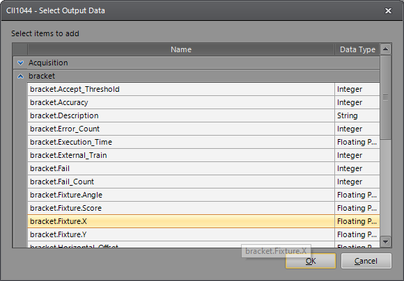

The "X" entry for each feature must have a special label to help parse the data. For the bracket example, the "Label" must be `;braket:`. Note the leading semicolon and trailing colon. Replace "bracket" with the name of the feature. Set "Data Type" to "String". Make sure "Use Delimiter" is checked and set to "Comma"

Now, add the Fixture.Y, Fixture.Angle, and Fixture.Score for the feature using the "Add" button. The "Output String" should match the general format in the sample image.

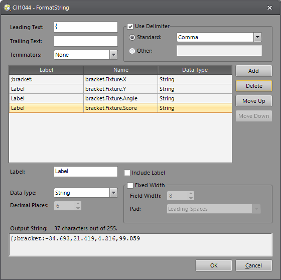

Now add any additional features to be recognized.

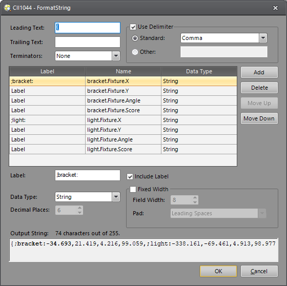

Note that all "Data Type" must be "String" or the sensor will not send updates unless all objects are detected.

Click "OK" to save the format string.

### Save Job

Click "Save Job" and save the job on the low panel.

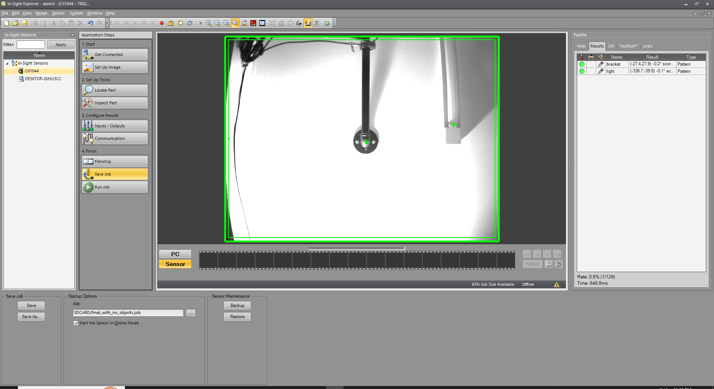

### Bring Device Online

Click the green power icon on the upper toolbar to bring the device online to begin receiving data.

## Run the Driver

See the main README.md file for instructions to run the driver. The IP address of the Cognex device
must be specified using the `--cognex-host=` parameter.
