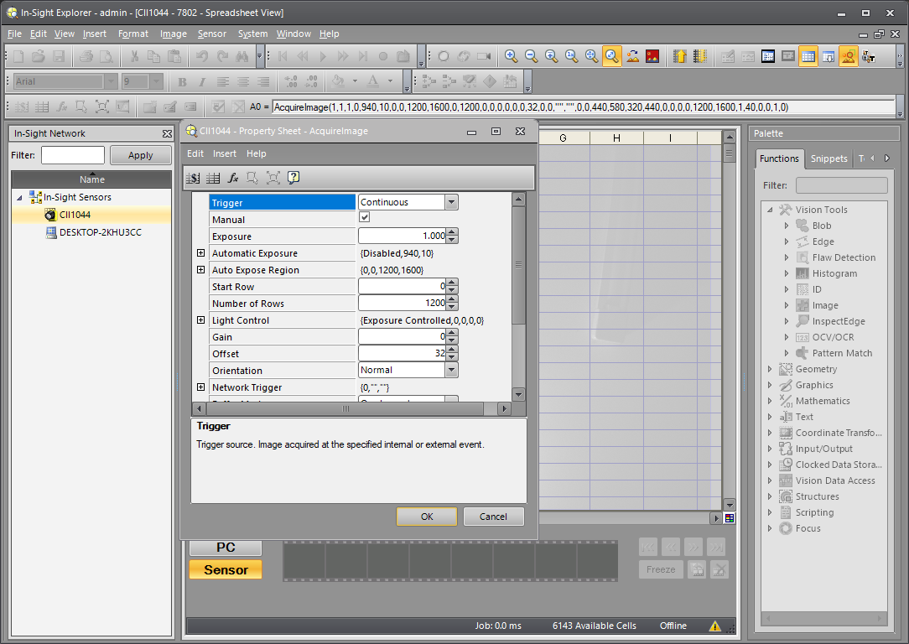
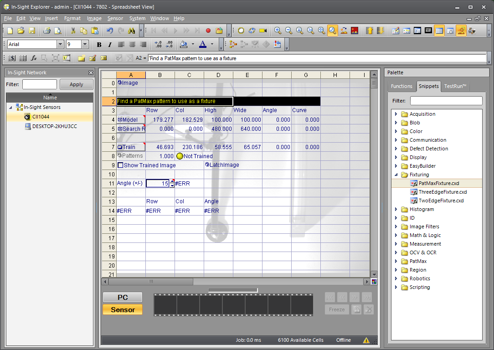
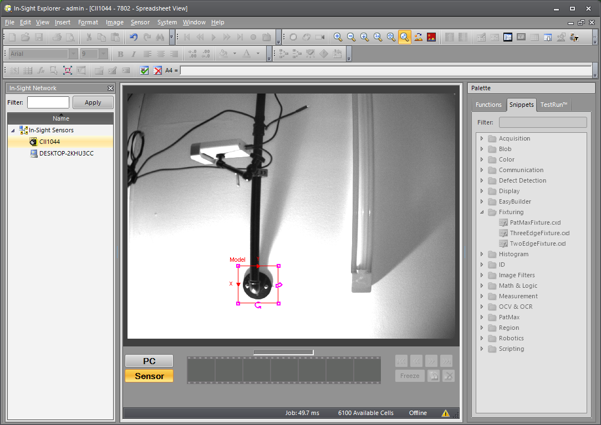
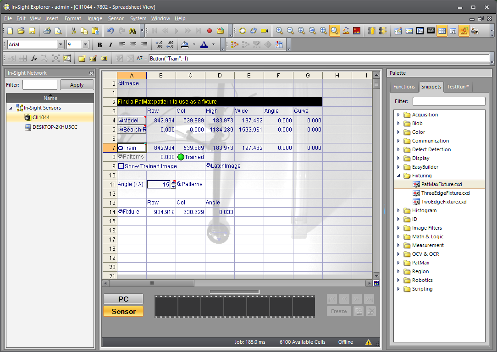
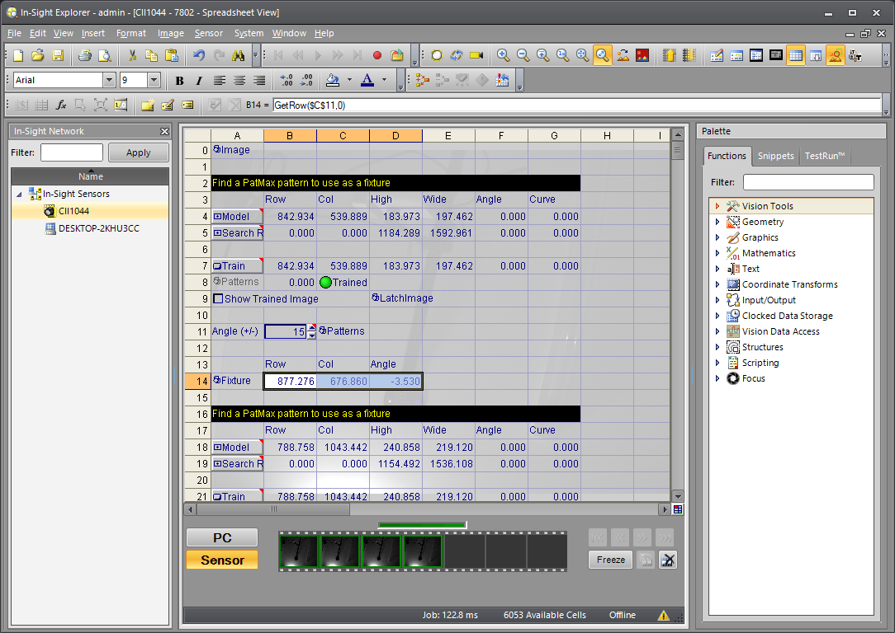
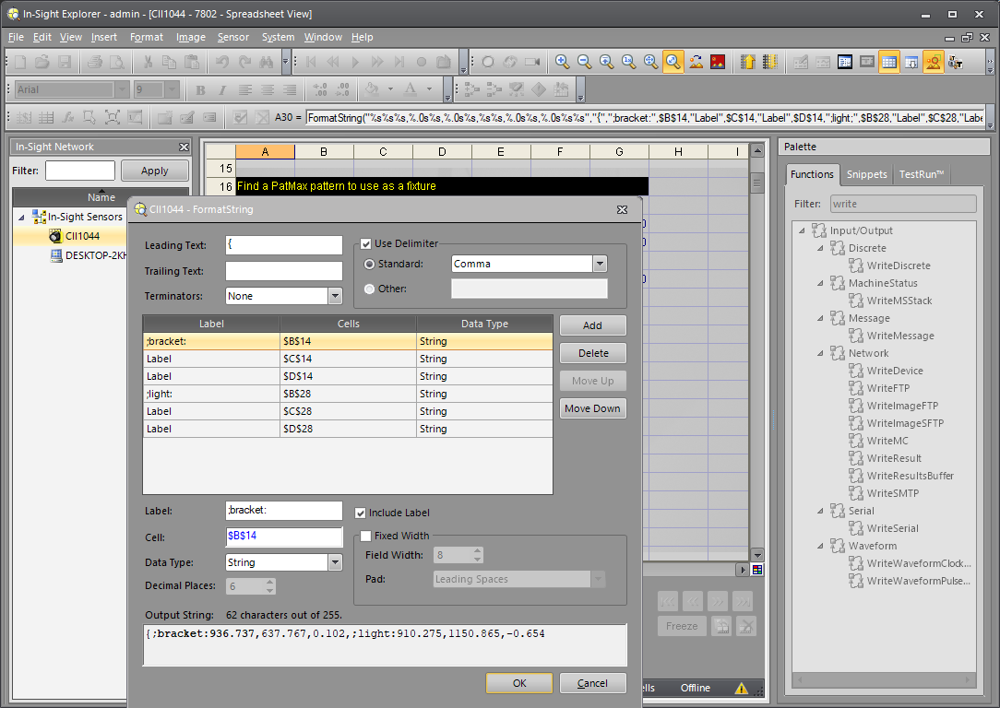
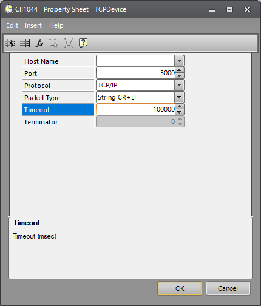
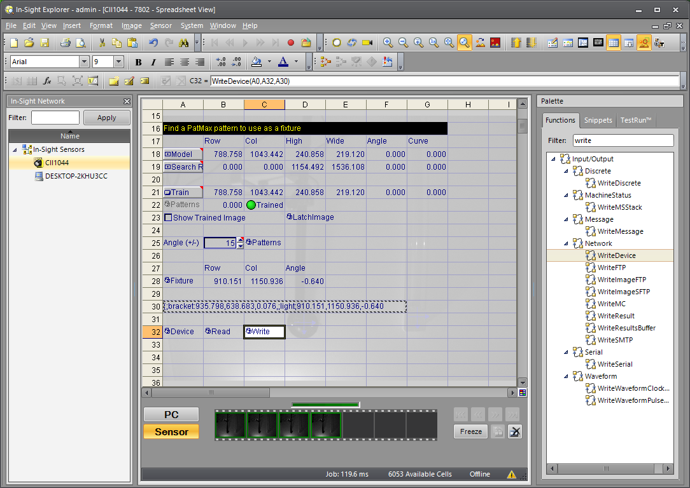

# Cognex Setup for Robot Raconteur Driver using Spreadsheet

Cognex devices use a "spreadsheet" programming paradigm. This programming method is unusual, and is difficult to
document. See the [Cognex Documentation](https://support.cognex.com/docs/is2d_2330/web/EN/InSight_Sheet/Content/Topics/GettingStarted/getstarted_sheet.htm)
for full explanations on using the spreadsheet programming.
This document provides a general overview of how to use the Robot Raconteur driver with the spreadsheet
programming mode, but the user will need to have a general understanding of the Cognex programming to
successfully configure the device.

## Device Setup

### Install the Cognex software

Install the appropriate software for the device. The exact version will vary, with newer and older devices
using incompatible software. See the documentation for the device to determine the required software release and version.
The example images are from In-Sight Explorer version 6.5.0 with a In-Sight 7000 series device.

See the documentation for instructions to configure network settings and communication with the sensor.


Save the IP address in this view. It will be needed later. The IP address can also be found by right
clicking on the device in the left list panel In-Sight Network and clicking Properties.

## Create a New Spreadsheet for Device

After connecting to the device, create a new spreadsheet for the device. See the documentation
for full explanation.

## Configure Acquire Image

A0 should be an "Image" cell by default. Add "Acquire Image" if it is not there.
This is the main trigger for the spreadsheet, and will
acquire the image. Double click to configure.



The trigger must be "Continuous" or "External". Use the `cognex_trigger_acquisition()` driver function
if external is used.

## Add Fixtures

Create fixtures that will be used a templates to match in the camera view. This example
uses the snippet PatMaxFixture.cxd that can be found in the "Snippets" under "Palette".
Configure the snippet to find the desired object as needed. Add more fixtures if needed.
This example uses two fixtures.







## Add FormatString

FormatString is used to build the text that is sent to the driver. This is the same as the format string used in the easy
builder, but uses spreadsheet cells instead.

The protocol format is

```
{;object1:<x>,<y>,<z>;object2:<x>,<y>,<z>
```

The left curly brace is used to start the output. Labels are
semicolon, the object name, and then colon followed by the
values. In this example confidence is not available. A fourth value can be added
for each object between 0-100 for the confidence. Do not add a terminator.
The WriteDevice function will add the terminator.

In the PatMaxFixture snippet the last row of cells contains the output
x,y,theta under the heading "Row", "Column", "Angle".





Note the data type must be set to "String" for all values!

An example correct output of the format string:

```
{;bracket:935.798,638.683,0.076,;light:910.151,1150.936,-0.640
```

## Add TCP/IP Communication

Add the TCPDevice. This may be TCPServer in newer Cognex software versions. Leave the "Host Name" blank for
TCPDevice so it will act as a server. Set the timeout
to a large value since the driver does not send data.



Insert a [WriteDevice()]() function by searching in the functions palette. The first argument for the function is the
trigger, in this case A0 for the image capture. The next argument is the TCPDevice, in this case A32. The final argument
is the data to send, in this case A30, the output
of the FormatString.



## Go Online and connect the driver

Go Online using the button on the toolbar. Run the driver
with the IP address of the device and run the examples to
test the setup.

## Detecting Large Numbers of Objects

This example uses fixture matching for a single object. It is also possible to match multiple objects
in the view using a single fixture using the `FindPatMaxPatterns` function. This will result
in multiple rows, each row for a detected instance. Use each row as an entry in the FormatString
described below, with each object named with an index such as `myobj1`, `myobj2`, with a unique name
for each row.

Each cell in the spreadsheet is limited to 255 characters meaning only a few objects can be contained
in each FormatString output cell. Use multiple FormatString with only the first one having the opening curly
brace. The `WriteDevice()` function accepts multiple cells to send as arguments, for instance
`WriteDevice(A0,A32,A30,A31,A32)` will concatenate the values of A30, A31, A32.

There may still be a limit to the number of characters `WriteDevice()` will send. If there are many detected
objects, create `FormatString()` for each row, and then use an `EditInt()` with `GetCellValue()`
to select which rows to send. The exact configuration will depend on your application.

## Conclusion

This guide is a brief overview of using the spreadsheet to configure the device for the Robot Raconteur driver.
The spreadsheet programming capability is complex, and the final design will vary based on the application.
The driver must receive a correctly formatted string from the TCPDevice (or TCPServer), but otherwise
the implementation details are not important. Follow the vendor documentation to configure to device
to the application requirements.
